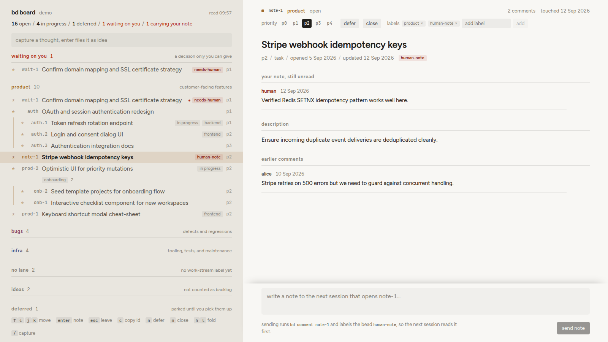

# bd-board

Local web board over a [beads](https://github.com/gastownhall/beads) backlog. Index on the left with sections and lanes, and the selected bead always open on the right with its Markdown-rendered description, notes, comments, sessions, and linked notes. Sending a note from the composer appends a comment under your own author id and can flag the bead so your coding agent reads it first on its next run. Search covers ids, titles, descriptions, notes and comments, on the board and from a terminal.



## requirements

- Node 22+
- `bd` on PATH
- a beads repository

## run

```bash
git clone https://github.com/thatmike1/bd-board
cd bd-board
npm install
npm run build
```

Run in any beads repo:

```bash
bd-board                 # in a beads repo; or: bd-board --repo /path/to/repo
```

Or keep it off your terminal:

```bash
bd-board start           # runs in the background, takes the same flags
bd-board status          # url of the board for this repo
bd-board stop            # ends it, from the same repo
```

Install the launcher once to run it from anywhere:

```bash
ln -s "$PWD/bin/bd-board.mjs" ~/.local/bin/bd-board
```

### search from a terminal or an agent

```bash
bd-board search "cooler swap"                 # all beads, closed and parked included
bd-board search webhook --scope open --json   # structured hits for an agent
```

Same ranking as the board's search box; see `docs/api.md` for the result shape.

### flags

| flag | default | description |
|---|---|---|
| `--repo <path>` | current directory | path to the beads repository |
| `--port <n>` | first free from `1338` | local port to bind; without it a second board next to a running one takes the next free port |
| `--config <path>` | `<repo>/.bd-board.json` | explicit path to config file |
| `--agentsview <url>` | from config or off | AgentsView server url |
| `--no-agentsview` | | force disable AgentsView join |
| `--no-open` | `false` | do not open default browser on start |

## works with no config

Out of the box with no configuration file, bd-board displays a complete board over any beads backlog:
- single open section containing all active beads, grouped hierarchically by epic and by project labels shared across 2+ beads
- deferred beads parked in their own section
- recently closed section showing the last twelve resolved items
- right pane detail view with descriptions, issue notes, and comment threads
- quick capture (`/`) to file new beads directly into your backlog
- full keyboard navigation

## designing labels for the board

To structure your backlog into custom lanes and workflow states, add an optional `.bd-board.json` file to the root of your beads repository.

### lanes

Pick 3 to 6 labels that answer "what kind of work is this", and give every open bead exactly one lane label. Beads without a lane label appear in an unlaned section.

Example vocabularies:
- by area: `product`, `bugs`, `infra`, `ideas`
- by horizon: `now`, `next`, `later`

### waiting flag

A flag label such as `needs-human`. Your coding agent adds this label when the next step requires human input or an architectural decision. The board pins these beads to a dedicated section at the very top.

### note flag

A flag label such as `human-note`. When you submit a note from the board's composer box, bd-board adds this label. Your agent inspects this label first, addresses your note, and clears the flag.

### thoughts drawer

A label such as `idea` for raw captures that should not clutter your active backlog. Beads carrying this label stay in a dedicated thoughts drawer and are excluded from lane counts. Set `capture.labels` to `["idea"]` and quick capture files every new bead there.

### project labels

Any other label that is not a lane label, sub-label, or workflow flag automatically groups beads within a lane whenever 2 or more beads share it.

### example configuration

### comment authors

`human` sets the author id the board writes your comments as, and the name shown for it. Give agents their own ids through `BEADS_ACTOR`, which bd stores as the comment author: `agent:claude`, `agent:codex`, `agent:gemini`, or plain `agent`. Set it wherever each harness takes environment variables (Claude Code: `env` in `settings.json`; Codex: `[shell_environment_policy] set` in `config.toml`). Comments whose author is neither the human id nor an agent id show as author unknown, which is where comments written before this lands under a shared git username end up.

Here is an example `.bd-board.json`:

```json
{
  "human": { "id": "human:alice", "name": "Alice" },
  "lanes": [
    { "label": "product", "note": "customer-facing features", "glyph": "*", "color": "#a06a2c" },
    { "label": "bugs", "note": "defects and regressions", "glyph": "!", "color": "#8b4a68" },
    { "label": "infra", "note": "tooling, tests, and maintenance", "glyph": "#", "color": "#47598a" }
  ],
  "unlaned": { "title": "no lane", "note": "no work-stream label yet" },
  "subLabels": ["frontend", "backend"],
  "waiting": {
    "labels": ["needs-human"],
    "title": "waiting on you",
    "note": "a decision only you can give"
  },
  "note": {
    "addLabel": "human-note",
    "offerToClear": ["needs-human"]
  },
  "thoughts": {
    "label": "idea",
    "title": "ideas",
    "note": "not counted as backlog"
  },
  "flags": ["blocked-external"],
  "capture": {
    "labels": ["idea"]
  }
}
```

## teaching your agent the labels

Add this block to your agent instructions (`AGENTS.md` or `CLAUDE.md`):

```markdown
### Beads Workflow and Labels

Every open bead carries exactly one lane label: `product`, `bugs`, or `infra`.

Flags:
- `needs-human`: add when the next step requires human decision or verification. Remove once decided.
- `human-note`: an unread note from the human written via bd-board. Read the human's latest comment (author `human:alice`) first, act on it or reply, and remove the label.

To find a bead from words you remember, run `bd-board search <words>` (add `--json` for structured hits); it searches titles, descriptions, notes and comments of every bead, closed ones included.
- `idea`: raw captured thought, not active backlog. Do not work on unless asked.
```

### labelling an existing backlog

If your beads carry no labels yet, write the config and the agent block above first, then ask your agent once: "read `.bd-board.json`, give every open bead exactly one lane label with `bd update <id> --add-label=<lane>`, and add `needs-human` where the next step is my decision. List what you changed." Review the board afterwards and move anything that landed in the wrong lane.

## optional joins

- **AgentsView**: if running [AgentsView](https://github.com/kenn-io/agentsview), bd-board searches local session transcripts and displays recent coding sessions that touched the selected bead. Configured via `"agentsview": "http://127.0.0.1:8080"` or `--agentsview`.
- **Notes directory**: set `"notesDir": "docs/notes"` to recursively scan a folder of markdown notes and link occurrences of the bead ID.
- **T3 Code**: thread titles from `~/.t3/userdata/state.sqlite` are discovered automatically when present.

## run as a service

Install bd-board as a systemd user service:

```bash
systemd/install.sh /path/to/your/beads-repo [port]
```

This builds the UI, generates `~/.config/systemd/user/bd-board.service`, reloads systemd, and starts the service.

## develop

```bash
npm run dev              # server on 1338 with tsx watch, vite ui on its own port proxying /api
npm run mock             # mock api from scripts/demo for ui work without bd
npm test                 # vitest test suite
npm run typecheck        # tsc type checks across server and ui
```

## layout

- `server/`: Node + Hono backend. `bd.ts` is the only place `bd` is executed; input arguments and IDs are validated before dispatch. `search.ts` is the search shared by the route and the cli, `authors.ts` reads comment authors.
- `ui/`: Vite + React frontend. `model.ts` derives render sections, groupings, and counts from the resolved board config and issue list.
- `docs/api.md`: HTTP contract between frontend and backend.

## keyboard

- `j` / `k` or `Down` / `Up`: move selection
- `Enter`: focus note composer
- `Esc`: leave note composer / blur
- `c`: copy short issue ID
- `n`: defer selected bead
- `m`: close selected bead
- `h` / `l`: fold / unfold section
- `s`: focus search; in the box `Up` / `Down` step through hits, `Enter` opens the hit and returns the keys to the list, `Esc` clears and puts the board back where it was
- `/`: focus quick capture
